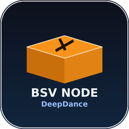

# BSV Solo Mining Dashboard



Ein vollstaendiges, quelloffenes Web-Dashboard zur Ueberwachung einer
**Bitcoin SV Full Node** und einer **Solo-Mining-Umgebung** auf dem
Raspberry Pi 5 (8 GB RAM) unter **5tratumOS**.

**Entwickelt und betrieben von [DeepDance](https://github.com/DeepDance1977).**

---

## Funktionen

**Node-Ueberwachung**
- Synchronisationsstatus, Blockhoehe, verbundene Peers
- Difficulty, geschaetzte Netzwerk-Hashrate, Node-Uptime
- CPU-, RAM-, Disk-Auslastung und Temperatur des Raspberry Pi 5

**Solo-Mining-Ueberwachung**
- Automatische Erkennung aller am Stratum-Server angemeldeten Miner
- Name, IP-Adresse, Live-Hashrate, akzeptierte/abgelehnte Shares
- Uptime je Miner, letzter Share-Zeitpunkt, Online/Offline-Status

**Wallet**
- Empfangsadresse, aktuelles Guthaben, letzte Transaktionen
- Separate Ansicht der zuletzt empfangenen Mining-Belohnungen

**Dashboard**
- Modernes, responsives Web-Interface mit Dark Mode
- Live-Aktualisierung per WebSocket, ohne Neuladen der Seite
- Charts fuer Hashrate- und Sync-Verlauf (Recharts)
- Vollstaendig mobiltauglich (Smartphone/Tablet)

**Benachrichtigungen**
- Telegram-Alerts: Miner offline/online, gefundener Block, Node-Fehler

**Sicherheit**
- Login-System mit JWT-Authentifizierung
- Rollenmodell: Admin / Operator / Betrachter
- HTTPS-faehig (per Reverse-Proxy, siehe INSTALL.md)

---

## Architektur

```
┌────────────┐     ┌───────────────┐     ┌──────────────────┐
│  Frontend   │◄───►│    Backend     │◄───►│   PostgreSQL      │
│ React + TS  │ WS  │ FastAPI + WS   │     │ (Historie/Events)  │
│ Tailwind    │     │ SQLAlchemy     │     └──────────────────┘
└────────────┘     │ JWT-Auth       │
                    │ APScheduler    │◄───►  Bitcoin SV Full Node (RPC/ZMQ)
                    └───────┬────────┘
                            │
                            ▼
                   Stratum-Server (HTTP-API oder Log-Datei)
                            │
                            ▼
                    Telegram Bot API
```

Optional enthaelt dieses Repo (`./node`) auch einen eigenstaendigen,
**sauber aus dem Quellcode gebauten Bitcoin-SV-Node fuer arm64** – siehe
[`node/README.md`](node/README.md). Dieser ersetzt fehleranfaellige,
generische Cross-Build-Setups (z.B. amd64-Images unter QEMU).

---

## Projektstruktur

```
bsv-dashboard/
├── backend/                  # FastAPI-Backend
│   ├── app/
│   │   ├── main.py
│   │   ├── config.py
│   │   ├── database.py
│   │   ├── models.py         # SQLAlchemy-Datenmodell
│   │   ├── schemas.py        # Pydantic-Schemas
│   │   ├── security.py       # JWT / Passwort-Hashing
│   │   ├── deps.py           # Auth-Dependencies / Rollen-Guards
│   │   ├── routers/          # API-Endpunkte
│   │   └── services/         # RPC-Client, Stratum-Monitor, Telegram, Scheduler
│   ├── Dockerfile
│   └── requirements.txt
├── frontend/                  # React + TypeScript + Tailwind
│   ├── src/
│   │   ├── pages/             # Dashboard, Miners, Wallet, Settings, Login
│   │   ├── components/        # StatCard, MinerTable, HashrateChart, ...
│   │   ├── hooks/useWebSocket.ts
│   │   └── context/AuthContext.tsx
│   ├── Dockerfile
│   └── nginx.conf
├── node/                       # Eigener BSV-Full-Node (arm64, Source-Build)
│   ├── Dockerfile
│   ├── bitcoin.conf.template
│   ├── docker-entrypoint.sh
│   └── README.md
├── app-store/                  # Umbrel- & 5tratumOS-App-Store-Manifeste
│   ├── bsv-solo-mining-dashboard/
│   └── deepdance-bitcoin-sv/
├── systemd/                    # Native systemd-Units (ohne Docker)
├── assets/                     # Icon (SVG/PNG) in allen Store-Groessen
├── docker-compose.yml
├── .env.example
├── LICENSE                     # MIT (DeepDance)
├── THIRD_PARTY_LICENSES.md     # Lizenzen aller verwendeten Komponenten
├── INSTALL.md
└── README.md
```

---

## Schnellstart (Docker Compose)

```bash
git clone https://github.com/DeepDance1977/bsv-solo-mining-dashboard.git
cd bsv-solo-mining-dashboard
cp .env.example .env
nano .env   # RPC-Zugangsdaten, Telegram-Token, Passwoerter eintragen
docker compose up -d --build
```

Danach: `http://<raspberry-pi-ip>:3000` aufrufen.
Erstanmeldung mit `BOOTSTRAP_ADMIN_USERNAME` / `BOOTSTRAP_ADMIN_PASSWORD`
aus der `.env` – **Passwort danach sofort in den Einstellungen aendern.**

**Installation über den App-Store (Umbrel/5tratumOS):** Dort wird das
Erstpasswort NICHT über die `.env` gesteuert, sondern ist fest auf
Benutzername `admin` / Passwort `changeme123` voreingestellt. Die App
zwingt dich beim allerersten Login automatisch dazu, ein eigenes,
individuelles Passwort zu vergeben, bevor du das Dashboard nutzen kannst –
du musst dir also nichts merken oder irgendwo nachschauen.

Ausfuehrliche Installationsanleitung (inkl. 5tratumOS, systemd, HTTPS,
App-Store-Einreichung): siehe [`INSTALL.md`](INSTALL.md).

---

## Lizenz

MIT-Lizenz, © DeepDance. Siehe [`LICENSE`](LICENSE).
Lizenzen aller verwendeten Drittkomponenten (inkl. der **Open BSV License**
fuer den Bitcoin-SV-Node): siehe [`THIRD_PARTY_LICENSES.md`](THIRD_PARTY_LICENSES.md).

## Mitwirken

Issues und Pull Requests sind willkommen:
https://github.com/DeepDance1977/bsv-solo-mining-dashboard/issues
